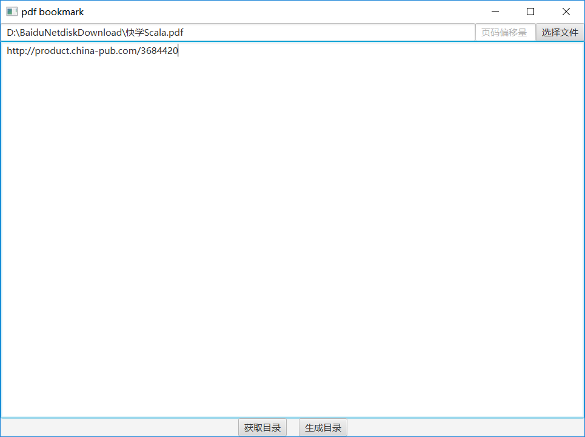
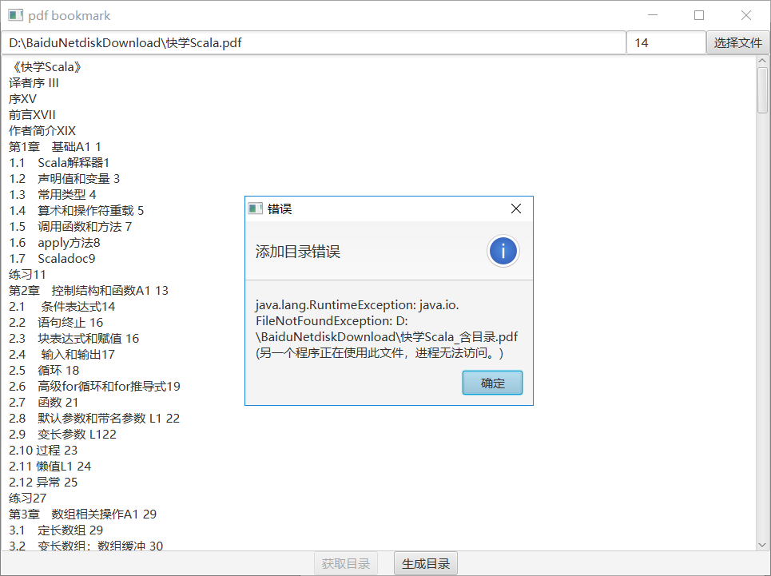
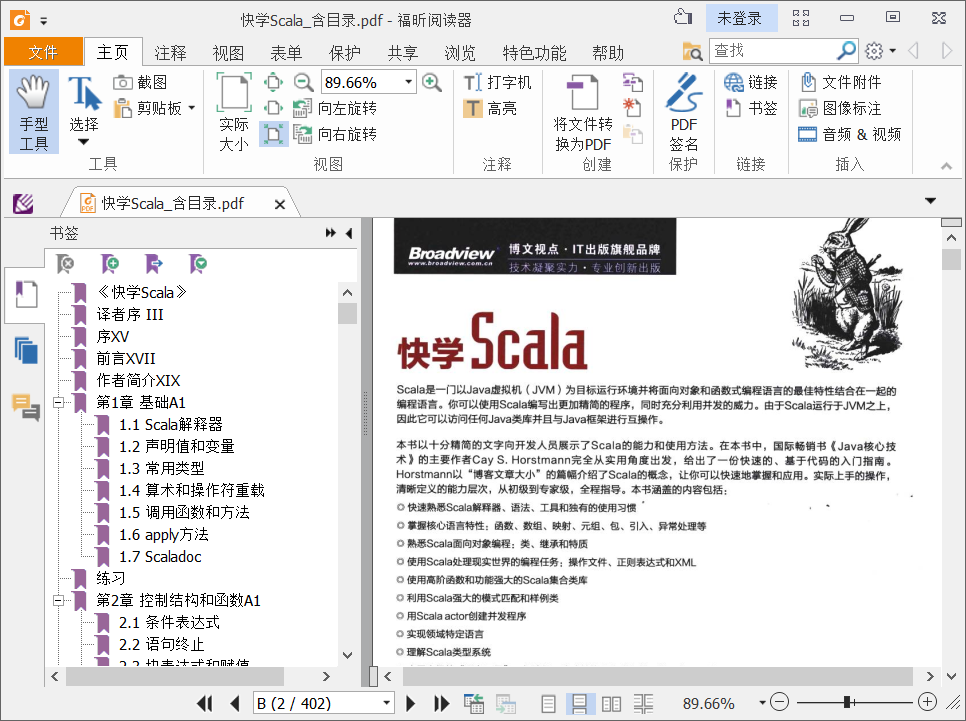

# pdf-bookmark

## 示例


## 下载地址
1. 下载地址：[pdf-bookmark](https://github.com/ifnoelse/pdf-bookmark/releases)
2. 执行方式：双击执行或者java -jar pdf-bookmark-`version`-all.jar
3. 环境要求：Java 8
## 简介
由于互联网上存在很多没有书签的pdf书籍，阅读起来十分不方便，手动添加书签工作量太大，本项目用来给pdf书籍自动打上书签方便阅读
<br />**软件界面**
<br />

## 使用方法
### 1. 选择pdf文件 ###
点击**选择文件**按钮选择要添加目录的pdf文件
### 2. 填写页面偏移量 ###
有的pdf为扫描版，所以目录中的页码（书籍页码）可能与pdf文件实际页码不同，目录中的页码与pdf文件实际页码之间的差值（实际页码-书籍页码）即为页码偏移量。
#### 2.1 确定页码偏移量的方法： ####
打开pdf文件将pdf翻到任意带页码的一页，如下图，通过pdf阅读软件查看书籍中的页码与实际页码，将这两个数字相减即可得到页码偏移量，比如下图中的页码偏移量为134-120=14

### 3. 设置目录内容 ###
目前设置目录内容的方法有以下两种
#### 3.1 在pdf-bookmark目录编辑框填入目录内容（方法一）
#### 3.2 或者包含此书目录内容的页面url（url方式目前只支持china-pub）（方法二）
#### 3.3 示例
假设要给《快学scala》自动生成目录书签，我们可以通过互联网书店找到目录内容，以[china-pub](http://www.china-pub.com/)为例，我们可以搜索到《快学scala》的详情页`http://product.china-pub.com/3684420`，以下为目录部分的截图

<br />以上为china-pub中书籍详情页目录部分，可以点击**↓展开全部内容**然后将完整目录复制到pdf-bookmark目录编辑框中，或者直接将此页面url填入目录编辑框
<br />**填入目录内容示例**
<br />
<br />**填入url示例**
<br />

### 4. 生成目录 ###
点击**生成目录**按钮会生成一个新的包含目录的pdf文件，如下图
<br />
<br />生成之后的pdf目录截图
<br />
## 关于目录内容格式
目录内容格式基本结构为`章节序号 章节标题 章节页码`即可，示例如下：
``` text
第1章　基础A1 1 
1.1　Scala解释器1 
1.2　声明值和变量 3 
1.3　常用类型 4 
1.4　算术和操作符重载 5 
1.5　调用函数和方法 7 
1.6　apply方法8 
1.7　Scaladoc9 
```
